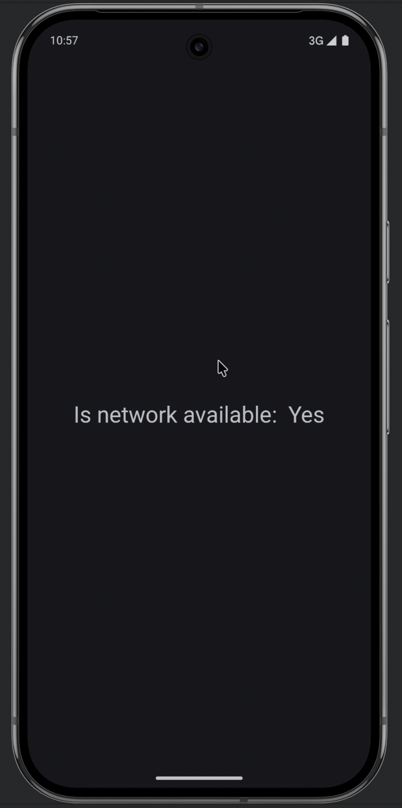
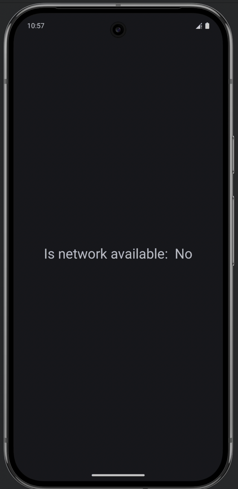

# NetworkWatcher

NetworkWatcher is a simple Android application built with Jetpack Compose that monitors and displays the real-time network connectivity status of the device.

## Features

- **Real-time Monitoring**: Continuously observes network changes (Available, Lost, Losing, Unavailable).
- **Reactive UI**: Updates the UI instantly using Kotlin Flows and Jetpack Compose.
- **Clean Architecture**: distinct separation of concerns with `ConnectivityObserver`, `ViewModel`, and UI layers.

## Screenshots

|                              Network Available                              |                             Network Unavailable                              |
|:---------------------------------------------------------------------------:|:----------------------------------------------------------------------------:|
|  |  |

## Tech Stack

- **Language**: Kotlin
- **UI Framework**: Jetpack Compose
- **Architecture**: MVVM (Model-View-ViewModel)
- **Concurrency**: Kotlin Coroutines & Flow
- **Android APIs**: `ConnectivityManager`, `NetworkCallback`
- **Libraries**:
    - `androidx.lifecycle:lifecycle-viewmodel-compose:2.6.2`: For integrating ViewModels with Jetpack Compose.

## How it Works

The application uses the Android `ConnectivityManager` to register a `NetworkCallback`. This callback feeds network status updates into a Kotlin `callbackFlow`, which is then exposed via a `ViewModel` as a `StateFlow`. The Compose UI observes this state and updates the text on the screen accordingly.

### Key Components

- **`NetworkConnectivityObserver`**: Implements the logic to listen for system network changes and emits `ConnectivityStatus`.
- **`NetworkObserverViewModel`**: Manages the UI state and exposes the connectivity status to the UI.
- **`NetworkObserverScreen`**: The Composable function that renders the "Is network available: Yes/No" message.

## Setup

1. Clone the repository.
2. Open the project in Android Studio.
3. Sync Gradle dependencies.
4. Run the application on an emulator or physical device.

## Permissions

The app requires the following permissions to function:
- `android.permission.INTERNET`
- `android.permission.ACCESS_NETWORK_STATE`
